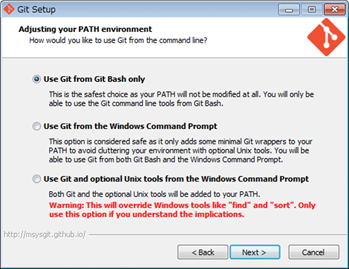
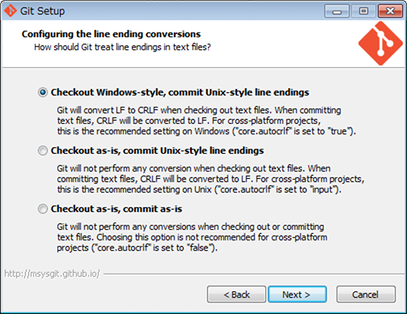

# CLI 環境を整える

まずは Mac, Windows ともに CLI 環境を整えておきましょう。

## 目次

* [Mac の場合](#mac)
* [Windows の場合](#win)

<a name="mac"></a>
## Mac の場合

Mac は [UNIX](http://ja.wikipedia.org/wiki/UNIX) ベースの OS なので、基本的な CLI 環境は最初から整っています。

php-abc-quests に沿って PHP の開発を行っていく上で不足しているものだけをここで追加でインストールしておきましょう。
具体的には、Git というバージョン管理システムだけです。

Git は以下の手順でインストールします。

1. [Homebrew](http://ja.wikipedia.org/wiki/Homebrew_%28%E3%83%91%E3%83%83%E3%82%B1%E3%83%BC%E3%82%B8%E7%AE%A1%E7%90%86%E3%82%B7%E3%82%B9%E3%83%86%E3%83%A0%29) をインストール
2. Homebrew を使って Git をインストール

### Homebrew をインストール

Homebrew は Mac の CLI にコマンドを追加インストールするための管理ツールです。ほぼデファクトスタンダード的なツールなので、安心してインストールしてください。

Homebrew のインストールは [http://brew.sh/index_ja.html](http://brew.sh/index_ja.html) の最下部にある

```
ruby -e "$(curl -fsSL https://raw.githubusercontent.com/Homebrew/install/master/install)"
```

というような一行スクリプトをコピーして、ターミナルに貼り付けて実行するだけです。

不安な方は [こちらのページ](http://www.tettori.net/post/1442/) などを参考にしてみてください。**（ただし、ターミナルにコピペするコマンドは古いものが書かれているので要注意です）**

### Homebrew を使って Git をインストール

Homebrew をインストールしたことで、CLI 上で `brew` というコマンドが使えるようになっています。
以下のように Homebrew から Git をインストールしてください。

```bash
# 念のため Homebrew 自体を最新にアップデート
$ brew update

# git コマンドをインストール
$ brew install git
```

これで Git のインストールは完了ですが、今後の Mac 上での Git ライフがより快適になるように一つだけおまじないを実行しておきましょう。

```bash
$ curl https://raw.githubusercontent.com/github/gitignore/master/Global/OSX.gitignore > ~/.gitignore_global
```

何も言わずにこれを実行しておいてください。（Git に詳しくなった頃にまた思い出して見返してみてください :smiley: ）

> ちなみに、Homebrew では他にも様々なコマンドを必要に応じてインストールできるので、CLI に慣れてきたら色々便利なコマンドを追加してみると良いでしょう。
>
> 例えば、`sl` コマンドをインストールして実行してみてください。
>
> ```bash
> $ brew install sl
> $ sl
> ```

これで Mac の CLI 環境の準備は完了です。お疲れさまでした！

<a name="win"></a>
## Windows の場合

### Git をインストール

次章以降に向けて、Git というバージョン管理システムをインストールします。
[Git for Windows](https://msysgit.github.io/) をインストールするだけで OK です。

インストール途中で次のような画面になるので、ここでは `Use Git from Git Bash only` を選択してください。



さらに次のような画面になるので、ここでは `Checkout Windows-style, commit Unix-style line endings` を選択してください。



インストールが完了すると、スタートメニューの中に `Git` というフォルダができていて、中に `Git Bash` という実行ファイルがあると思います。

**今後の CLI の操作はすべてこの Git Bash を使って行います。**（Windows 標準のコマンドプロンプトは使いません。）

なので、デスクトップ等の分かりやすい場所に Git Bash のショートカットを作成しておくとよいでしょう。

### Git Bash の設定を変更

インストールしたままだと日本語環境で上手く動かなかったりするので、少しだけ設定を変更しておきます。

1. まずは、Git Bash のウィンドウのタイトルバー右クリックからプロパティを開いて、フォントを `MS ゴシック` に変更してください。初めから `MS ゴシック` が選択されていても、念のため `OK` をクリックして確定させてください。（これをやらないと、デフォルトのフォントだと日本語が表示できなかったりします）

2. 次に、Git Bash のプロンプトに、何も考えずに以下のとおりに打ち込んでください（コピペ推奨）。（日本語が文字化けしないようにしたりするために最初に一回やっておくだけのおまじないです。意味が分からないと思いますが気にしないでください :bow: ）

```
$ cd ~
$ touch .bashrc
$ echo "alias ls='ls --show-control-chars'" >> .bashrc
$ echo "alias view='vim -R'" >> .bashrc
```

打ち終わったら、Git Bash を一度閉じてください。（一度閉じて開き直さないと、変更した設定が反映されません）

これで Windows の CLI 環境の準備は完了です。お疲れさまでした！
