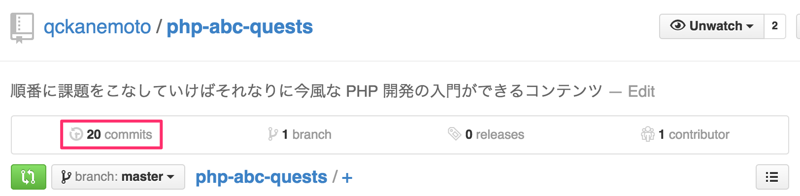

# fork して push してみる

GitHub のアカウントができたので、記念すべき最初のリポジトリを作ってみましょう。

全く新しいプロジェクトを始める場合は空のリポジトリを作って開発を始めるのが普通ですが、php-abc-quests では、あなたの GitHub アカウント上に [qckanemoto/php-abc-quest](https://github.com/qckanemoto/php-abc-quest) のコピーを作成して、そこで課題のソースコードを管理していきます。

このように、GitHub では他人のリポジトリを自分のアカウント配下にコピーしてくることができ、これを **fork（フォーク）する** と言います。

## Git の設定をいい感じにしておく

と、その前に、まずは Git の設定をいい感じにしておきましょう。（ここで一度だけやっておけば OK です）

```bash
# git コマンドのユーザ情報と GitHub のユーザ情報を合わせておく
$ git config --global user.name "[GitHub のユーザ名]"
# 例: git config --global user.name "hogehoge"
$ git config --global user.email "[GitHub に登録したメールアドレス]"
# 例: git config --global user.email "hugahuga@test.com"

# git コマンドで表示される内容を色付きにして見やすくする
$ git config --global color.ui auto

# 日本語のファイル名が文字化けしないようにする
$ git config --global core.quotepath false
```

## qckanemoto/php-abc-quests を fork してみる

では、本題に戻ります。

今見ている画面の右上に、`Fork` と書かれたボタンがあると思います。これを右クリックして新しいタブで開いてください。

しばらく待つと、あなたのアカウントの配下に php-abc-quests リポジトリがコピーされます。

fork した時点では、元のリポジトリのコミットログがすべて引き継がれていますが、今後ファイルを追加したり編集したりしても、当然ながら元のリポジトリには一切影響せず、自分のリポジトリ側だけに引き続きコミットが積み上がっていくような形になります。

ここから先の課題では、この fork したリポジトリにソースコードを push していきます。

## ローカルに clone してみる

GitHub 上にリポジトリができたので、これをリモートリポジトリとして、ローカルに clone してみましょう。

fork して作ったあなたのリポジトリを GitHub で表示すると、画面右側に `HTTPS clone URL` と書かれた欄があると思います。
ここに書かれている URL があなたのリポジトリの URL です。
これをコピーして、以下のように `git clone` コマンドを実行してください。

```bash
$ cd ~/workspace
$ git clone https://github.com/hogehoge/php-abc-quests.git
```

これで、`~/workspace` の直下に `php-abc-quests` というディレクトリが作られ、そこにリモートリポジトリの内容が全てダウンロードされたはずです。

## ローカルで作業してみる

では、ローカルリポジトリで実際に何か作業をしてみましょう。

`~/workspace/php-abc-quests/practices/02` というディレクトリがあるので、そこに `hello-git.txt` というファイルを作ってみてください。

```bash
$ cd ~/workspace/php-abc-quests/practices/02

# "hello-git.txt" というファイルを作ってみる
$ touch hello-git.txt
```

この時点で `git status` してリポジトリの状態を確認してみてください。

```bash
# ローカルリポジトリの状態を確認
$ git status
On branch master
Your branch is up-to-date with 'origin/master'.

Untracked files:
  (use "git add <file>..." to include in what will be committed)

        hello-git.txt

nothing added to commit but untracked files present (use "git add" to track)
```

`Untracked files:` の中に `hello-git.txt` が挙がっています。`Untracked` というのは **「Git 管理下にない」** という意味です。今までリポジトリ内になかったファイルで、かつインデックスに追加していないからですね。

```bash
# 全ての変更をインデックスに追加
$ git add .

# 状態を再確認
$ git status
On branch master
Your branch is up-to-date with 'origin/master'.

Changes to be committed:
  (use "git rm --cached <file>..." to unstage)

        new file:   hello-git.txt
```

インデックスに追加したので、`Changes to be committed:` の中に `new file` というステータスで表示されました。

ただファイルを追加しただけですが、練習なのでこれをコミットしてみましょう。

```bash
# コミットしてみる
$ git commit -m "ファイルを追加してみるテスト"

# 状態を再確認
$ git status
On branch master
nothing to commit, working directory clean
```

コミットしたあとで `git status` を再度確認してみると、`nothing to commit` となりました。変更はすべてコミットされたので、ワークツリーに変更が何もない状態になったわけですね。

## ローカルの作業をリモートに push してみる

ローカルで追加したコミットをリモートに push してみましょう。

GitHub リポジトリに書き込むには権限が必要なので、ユーザ認証を求められます。（パスワードの部分は打った文字が表示されないのでご注意を）

```bash
$ git push
Username for 'https://github.com': [GitHub のユーザ名]
Password for 'https://hogehoge@github.com': [GitHub のパスワード]
```

もし `git push` がエラーになる場合は、

```bash
$ git push --set-upstream origin master
```

と打ってください。最初の一回だけこの方法で push しておけば以降は `git push` でエラーにならなくなるので、ひとまず意味は分からなくても大丈夫です :bow:

push が完了したら、GitHub の自分のリポジトリの画面を開いて、左上にある `[数字] commits` と書かれたリンクをクリックしてください。



コミット一覧画面が表示されるので、先ほどのコミットが追加されていることを確認しましょう。

これで GitHub の入門は完了です！お疲れさまでした！
